# Contributing to Thesaurus

## Architecture



**Components:**
- **TCP listener** — accepts incoming connections and spawns a handler task per client
- **Handler tasks** — decode RESP2 input, dispatch commands, write responses
- **Shared store** — an `Arc<RwLock<HashMap>>` shared across all handler tasks
- **TTL worker** — background task that evicts expired keys
- **AOF log** — optional on-disk persistence via append-only file

## Getting started

```bash
git clone https://github.com/kvasi34/thesaurus.git
cd thesaurus
cargo build
RUST_LOG=trace cargo run -p thesaurus -- --port 6379
```

Test it with any Redis-compatible client:

```bash
redis-cli ping
redis-cli set foo bar
redis-cli get foo
```

## Running tests and linting

```bash
cargo test
cargo clippy
cargo fmt
cargo audit     # requires: cargo install cargo-audit
```

## Making changes

- Open a PR against `main` — direct pushes are not allowed
- All CI checks must pass: `build`, `test`, `clippy`, `fmt`, `audit`
- PRs are merged via squash merge
- Commit messages must follow [Conventional Commits](https://www.conventionalcommits.org/en/v1.0.0/)

## Supported commands

| Command      | Signature                    |
|--------------|------------------------------|
| `PING`       | `PING [message]`             |
| `GET`        | `GET key`                    |
| `SET`        | `SET key value`              |
| `DEL`        | `DEL key [key …]`            |
| `EXISTS`     | `EXISTS key [key …]`         |
| `EXPIRE`     | `EXPIRE key seconds`         |
| `TTL`        | `TTL key`                    |
| `PERSIST`    | `PERSIST key`                |
| `PEXPIREAT`  | `PEXPIREAT key unix-ms`      |
| `SELECT`     | `SELECT index`               |
